# App Architecture — Sequence Diagram

An end-to-end sequence diagram of how the mbuffs application fits together, covering
the main user journeys across the frontend, API, auth, database, and external services.

## Actors (lifelines)

| Lifeline | What it represents |
| --- | --- |
| **User** | Browser / installed PWA |
| **Frontend (React Query)** | React 19 SPA — `src/lib/api.ts` client, `useAuth`, TanStack Query |
| **Auth (Better Auth + Google)** | `backend/lib/auth.ts` session engine + Google OAuth + Turnstile |
| **Express API + Middleware** | `backend/api/index.ts`, `deserializeUser` / `requireAuth` / permission guards |
| **Controllers and Services** | content, collection, recommendation, review, omdb, parentalGuidance, notification |
| **Postgres (Neon)** | Data store via Drizzle / `sql` (`backend/db/schema.ts`) |
| **TMDB API** | Movie / TV metadata (proxied through `POST /api/content`) |
| **OMDb / Reddit / Scraper / Push** | OMDb ratings, Reddit candidates, IMDb scraper microservice, Web Push (VAPID) |

## Phases shown

1. **App load & authentication** — session validation, sign-in (email + Turnstile or Google), recommendation cache warm.
2. **Browse & search (public)** — `POST /api/content` TMDB proxy with adult-content filtering.
3. **Title detail (parallel enrichment)** — TMDB metadata, OMDb ratings, certification + parental guidance (scraper → IMDb), reviews.
4. **Collections, watched, sharing (auth)** — permission checks, `collection_movies` writes, cache expire/warm, Web Push to collaborators.
5. **Personalized recommendations (auth)** — cached `recommendationService`; on cache miss, build pool from collections/Reddit/TMDB, score/rank/diversify, save.
6. **Notifications** — Web push delivery and notification fetch.

## Files

| File | Purpose |
| --- | --- |
| `app-architecture-sequence.tldraw` | **Editable source.** Open in [tldraw Desktop](https://github.com/tldraw/tldraw-offline) to modify. |
| `app-architecture-sequence.svg` | Rendered vector image (embedded above). |
| `app-architecture-sequence.jpg` | Rendered raster image (fallback / previews). |

## Updating the diagram

1. Open `app-architecture-sequence.tldraw` in the tldraw Desktop app.
2. Edit the diagram. It was generated from a Mermaid `sequenceDiagram` (see the source
   in the project history), so you can either adjust shapes directly or regenerate from
   Mermaid and re-lay it out.
3. Re-export the images to keep them in sync:
   - **SVG:** File → Export → SVG (whole page), save over `app-architecture-sequence.svg`.
   - **Image:** File → Export → PNG/JPEG, save over `app-architecture-sequence.jpg`.
4. Commit the updated `.tldraw` **and** the regenerated image(s) together so the source
   and the rendered preview never drift apart.
