# Login Flow — Sequence Diagram

A detailed sequence diagram of the mbuffs authentication flow, covering both the
email + password and Google OAuth paths, plus the shared post-login session bootstrap.

## Actors (lifelines)

| Lifeline | What it represents |
| --- | --- |
| **User (Browser / PWA)** | The person signing in |
| **Auth Page** | `src/pages/Auth.tsx` + `src/lib/auth-client.ts` (Better Auth React client) |
| **Cloudflare Turnstile** | CAPTCHA widget + server-side `siteverify` |
| **Better Auth** | `backend/lib/auth.ts`, mounted at `/api/auth` |
| **Google OAuth** | External identity provider |
| **Postgres** | `user` / `account` / `session` tables (Drizzle adapter) |

## Flow summary

### Email + password
1. Turnstile widget renders and yields a captcha token; the form blocks submit without it (`Auth.tsx:111`).
2. `POST /api/auth/sign-in/email` with the `x-captcha-response` header (`Auth.tsx:126`).
3. Better Auth verifies the token via Turnstile `siteverify` (captcha plugin, `auth.ts:50`).
4. It looks up the credential account, verifies the password hash, inserts a session, and sets the cross-origin cookie (`sameSite: none`, `secure`, 7d — `auth.ts:71`). Invalid credentials return `401` and reset the captcha.

### Google OAuth
1. `signIn.social` → `GET /api/auth/sign-in/social` (`Auth.tsx:202`) → 302 to Google consent.
2. Callback `GET /api/auth/callback/google` with the code; Better Auth exchanges it for tokens.
3. Upserts the user and links the Google account (`accountLinking`, `auth.ts:122`), inserts a session.
4. The `session.create` DB hook backfills `user.image` from the `id_token` (`auth.ts:127`).

### Shared bootstrap
- `GET /api/auth/get-session` (5-min cookie cache) validates the session and returns the user with custom fields (`role`, prefs).
- The frontend caches a `localStorage` snapshot for instant PWA load and warms the recommendation cache (`POST /api/recommendations/warm`).

## Files

| File | Purpose |
| --- | --- |
| `login-flow.tldraw` | **Editable source.** Open in [tldraw Desktop](https://github.com/tldraw/tldraw-offline) to modify. |
| `login-flow.svg` | Rendered vector image (embedded above). |
| `login-flow.jpg` | Rendered raster image (fallback / previews). |

## Updating the diagram

1. Open `login-flow.tldraw` in the tldraw Desktop app.
2. Edit the diagram. It was generated from a Mermaid `sequenceDiagram`; note two
   converter constraints if you regenerate from Mermaid: nested `alt` blocks are not
   supported, and semicolons in message text are treated as statement separators (use commas).
3. Re-export the images to keep them in sync:
   - **SVG:** File → Export → SVG (whole page), save over `login-flow.svg`.
   - **Image:** File → Export → PNG/JPEG, save over `login-flow.jpg`.
4. Commit the updated `.tldraw` **and** the regenerated image(s) together.
